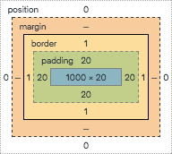

CSS는 쉬운 듯하면서도 어렵다. 복잡한 로직은 없지만 이름 그대로 중첩(cascading)되는 성질 때문에 기대했던 결과가 나오지 않는 경우가 무척 많다. 때에 따라서는 디버깅에 자바스크립트 버그 수정보다 많은 시간을 투자해야 하는 경우가 생기기도 한다. 까다로운 CSS를 상대하기 위해 [SMACSS](https://smacss.com/), [BEM](http://getbem.com/)같은 방법론을 적용하기도 하고 [CSS module](https://github.com/css-modules/css-modules), [shadow DOM](https://developer.mozilla.org/ko/docs/Web/Web_Components/Shadow_DOM)처럼 기술적인 대안을 마련하기도 한다. 하지만 모든 것을 만족하게 할 수 있는 방법론은 없기에 CSS의 특성을 잘 이해한 상태에서 앞서 언급한 기술들을 필요한 곳에 적용해야 제대로 된 스타일 시트 작성이 가능할 것이다.

얼마 전에 읽은 ['8 simple rules for a robust, scalable CSS architecture'](https://github.com/jareware/css-architecture/blob/master/README.md#7-respect-component-boundaries)라는 글에서는 어떻게 하면 좋은 CSS를 작성할 수 있는지 아주 잘 정리해 두었다. 지금껏 다양한 글에서 읽어 왔던 CSS에 대한 조언을 하나로 합쳐 정리한 글을 읽은 듯한 느낌이었다. 앞으로 프론트엔드 개발을 하면서 계속 참고해야 할 내용인 것 같아서 정리해 보려고 한다.

---

## 목표

- 컴포넌트 지향: 컴포넌트 기반의 UI에 맞춘 CSS
- 샌드박스: 로컬 컴포넌트의 스타일을 외부 스타일로부터 보호
- 편리함: 사용하는 데 어려움이 없어야 함
- 안전한 경우 오류 허용: 로컬 컴포넌트 스타일 기반이지만 전역 스타일은 예외적으로 허용 가능


## 항상 클래스 이름 셀렉터를 우선한다.

CSS에 아이디(ex. #something), 태그(ex. div, a, p, ...)를 사용하지 않는 편이 좋다. 아이디는 하나의 요소에만 적용할 수 있으니 당연히 피하는 것이 좋고 태그는 오류 발생 가능성이 커진다. 스타일 시트가 수백 줄 이상으로 길어질 경우 이미 특정 태그에 스타일을 지정해 둔 상태에서 해당 태그에 클래스를 지정해서 스타일을 추가하는 경우가 발생할 수 있다. 그러면 태그에서 선언한 스타일이 병합되어서 의도하지 않은 결과가 나올 수 있다. 그리고 컴포넌트 내부에 자식 컴포넌트가 존재할 경우 태그 스타일은 전파가 되기 때문에 자식 컴포넌트에서 해당 태그를 사용할 경우 외부 스타일이 유입되는 결과를 낳게 된다.


## 컴포넌트 코드들은 같은 폴더에 둔다.

마크업, 스크립트, 스타일 시트, 테스트코드 파일들은 같은 폴더에 함께 위치시키는 것이 작업하기에 편하다. Angular 2를 사용할 경우 angular-cli를 이용해 컴포넌트를 생성시키면 아래와 같은 형태로 4개의 파일을 동시에 만들어준다.

```
ui/
├── layout/
|   └── Header.html            // 컴포넌트 마크업
|   ├── Header.js              // 컴포넌트 코드
|   ├── Header.scss            // 컴포넌트 스타일
|   └── Header.spec.js         // 컴포넌트 테스트 코드
```


## 클래스 이름을 일관적으로 작성한다.

마크업과 스타일 시트 작성 시 클래스 이름명을 그때그때 생각나는 대로 붙여버리면 그 순간은 편하지만, 언젠가 디버깅할 때 괴로움이 반드시 찾아오게 된다. 그나마 직접 작성한 코드라면 어렴풋이 기억이라도 나겠지만, 타인의 코드라면? 게다가 정해진 기준 없이 클래스를 여기저기 붙여버렸다면? 하나를 건드리면 다른 한곳에 구멍이 뚫리는 루프를 경험할 수 있을 것이다.

이와 같은 문제를 방지하고 공동 작업의 효율을 위해 제안된 것이 SMACSS, BEM, [SUIT](https://suitcss.github.io)같은 방법론들이다. 각각 조금씩 다르지만 기본적으로 block(컴포넌트), entity(컴포넌트 하위 요소), modifier(하위 요소 중에서 일부만 변경된 경우), utility(버튼 같은 공유 스타일), state(hover 등의 상태 변경 시 일부 스타일이 변경되는 경우) 등으로 클래스를 구분해서 마크업과 스타일 시트를 작성하자는 내용이다. 개인적으로는 SUIT에서 제안하는 방법을 주로 사용하고 있다.


## 컴포넌트 파일명과 클래스 이름을 확실히 대응시킨다.

특히 셀렉터에 컴포넌트 명을 붙여주면 디버거에서 클래스 이름명만 확인해도 어떤 컴포넌트에서 만들어진 요소인지 바로 확인할 수 있다는 장점이 있다. 여기서 한발 더 나아가 클래스 이름 앞에 앱의 이름을 붙이는 방법도 제안할 수 있는데 이 경우 복수의 프로젝트 사이에서 코드를 공유하는 경우 도움이 될 것이다.


## 컴포넌트 외부로 스타일이 전파되지 않도록 한다.

앞서 언급한 규칙 중에서 태그를 사용하지 말라는 것과 관련이 있는 내용이다. CSS module을 사용하지 않을 경우 부모에서 사용한 클래스 이름명과 자식 컴포넌트에서 사용한 클래스 이름명이 중복될 가능성이 얼마든지 있기에 스타일이 유입될 가능성도 함께 존재한다. 이를 방지하기 위해서는 모든 클래스 이름명에 컴포넌트의 이름을 붙여주는 방법을 사용하는 것이 가장 확실하다.

```scss
.myapp-Header-btn {
  background: black;
  color: white;
}

.myapp-Header-link {
  color: blue;
}
```

하지만 이렇게 작성할 경우 중복 텍스트가 너무 많아지기에 어느 순간 본능이 요구하는 대로 클래스 이름명을 짧게 사용하고 싶은 마음이 샘솟게 될 것이다. 이를 방지하기 위해서는 Sass, Less, [PostCSS](https://github.com/postcss/postcss)의 [precss](https://github.com/jonathantneal/precss) 플러그인 등이 제공하는 부모 참조 선택자(`&`)를 사용할 수 있다.

```scss
.myapp-Header {
  &-btn {
    background: black;
    color: white;
  }

  &-link {
    display: block;
  }
}
```

## 외부 스타일이 컴포넌트로 전파되지 않도록 하라.

태그 또는 일반적인 클래스 이름(ex. btn)을 사용하면 자식 요소에 스타일이 전파될 가능성이 커진다. 굳이 태그를 사용해야겠다면 자식 요소 선택자(`>`)를 사용하는 방법이 있다.

```scss
.myapp-header {
  & > a {
    color: blue;
  }
}
```

하지만 스타일 시트 작성시 [명시도](https://developer.mozilla.org/ko/docs/Web/CSS/Specificity)는 가능하면 높이지 않는 편이 좋다. 높은 명시도의 단점은 아래와 같다.

- 의도하지 않은 곳에 스타일이 적용될 수 있다. (과연 `li > a` 에 해당하는 마크업이 처음에 생각한 곳 하나뿐일까?)
- 마크업 구조가 변경되면 셀렉터도 함께 변경해야 해서 리팩토링을 어렵게 만든다.
- 스타일을 적용하기 위해서는 셀렉터에 대응하는 마크업을 사용해야만 하므로 재사용성이 떨어진다.

부모 컴포넌트로부터 스타일이 유입되는 일은 어느 정도 방지할 수 있다. 하지만 [reset.css](http://cssreset.com/scripts/eric-meyer-reset-css/), [normalize.css](https://necolas.github.io/normalize.css/)같은 전역 스타일이나 사용자가 직접 지정한 전역 스타일이 유입되는 일은 근본적으로 방지할 수는 없다.(특히 Bootstrap을 사용할 경우 수천개의 *일반적인* 클래스 이름을 가진 스타일 부대의 유입을 방지해야 한다)

iframe을 사용하면 부모 컴포넌트와 완벽하게 분리할 수는 있지만 추가 페이지 로드 부담이 생긴다. 그리고 shadow DOM은 브라우저 지원 이슈 때문에 아직은 적극적으로 사용하기는 어려운 상황이다.


## 컴포넌트의 경계를 중시하라.

예를 들어 헤더, 네비게이션 바, 컨텐츠 컴포넌트를 포함한 부모 컴포넌트가 있다면 자식 컴포넌트들의 레이아웃과 관련된 스타일을 작성해야 할 것이다. 하지만 이 경우 결코 컴포넌트 내부의 스타일은 건드리지 말고 CSS box model 바깥의 스타일(position, margin, display, width, float, z-index)만 선언해야 한다.




## 외부 스타일을 느슨하게 연결하라

반복적인 스타일은 공유하게 된다. 하지만 전역 스타일을 지정한 후 마크업에 외부 클래스를 직접 연결하는 것보다는 @extend 같은 키워드를 이용해 스타일 시트에서 직접 추가하는 방법이 더 좋다. 마크업에 클래스 이름을 나열하는 것보다는 스타일 시트를 통해 외부에서 상속받은 스타일과 컴포넌트에 직접 추가한 스타일을 한번에 확인하는 편이 더 직관적이다.

```html
<button class="myapp-Button">
```

```scss
.myapp-Button {
  @extend .btn;
}
```

외부 스타일을 적용하는 방법으로는 Sass의 extend/mixin, [cssnext](http://cssnext.io/)의 [custom properties set & @apply](http://cssnext.io/features/#custom-properties-set-apply)를 이용하는 방법 등이 있다.

```scss
:root {
  --danger-theme: {
    color: white;
    background-color: red;
  };
}

.danger {
  @apply --danger-theme;
}
```

---

CSS를 아키텍처를 제대로 구성하는 일은 생각보다 어려운 일이기에 Bootstrap같은 프레임워크가 높은 인기를 가지게 된 것은 자연스러운 현상이다. 하지만 모든 것을 외부 프레임워크에 의존할 수는 없다. React, Angular, Vue같은 컴포넌트 기반의 라이브러리가 널리 사용되는 상황에서 CSS 작성도 그에 맞춰서 컴포넌트 기반으로 견고하게 작성할 수 있도록 해야 할 것이다.

