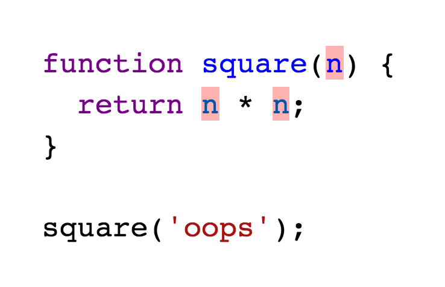

이 글은 James Kyle의 [Adopting Flow & TypeScript - A comparison between the two on-boarding processes](http://thejameskyle.com/adopting-flow-and-typescript.html)를 번역한 글입니다.

---

우리가 타입 검사기를 도입한다고 가정해보자.

앱 개발 중에 NaN값이 많이 발생해서 원인을 찾아보았고 아래의 코드를 찾을 수 있었다.

```javascript
// math.js
function square(n) {
 return n * n;
}
square("oops");
```

한숨을 쉬면서 이제는 정말로 타입 검사기를 도입해야겠다고 결심하게 된다. 그리고 한발 물러서서 우리에게 어떤 대안이 있는지 알아본다: [Flow](https://flow.org/)와 [TypeScript](http://www.typescriptlang.org/)가 있다.

둘다 간단하게 파일별로 채택이 가능하다.

- Flow: `// @flow` 코멘트를 파일 최상단에 추가한다.
- TypeScript: 파일의 확장자 `.js`를 `.ts`로 변경한다.

하지만 각각 어떤 일이 일어나는지 비교해보자.


## TypeScript 채택

TypeScript를 채택하기 위해서는 우선 확장자 `.js`를 `.ts`로 변경한다.

```javascript
// math.ts
function square(n) {
 return n * n;
}
square("oops");
```

그러고는 TypeScript를 실행한다.

```javascript
(no errors)
```

TypeScript는 아래와 같이 우리가 함수의 인자에 직접 타입 주석(annotation)을 작성하도록 요구하기 때문에 오류가 발생하지 않는다.

```javascript
function square(n: number): number {
 return n * n;
}
square("oops");
```

그런데 타입 주석이 없으면 TypeScript는 설정에 기반을 둬 아래 두 가지 행동 중에서 하나를 실행한다.

1. 확인되지 않은 모든 타입을 `any` 타입으로 묵시적으로 형 변환(cast)한다. `any` 타입은 타입 체크를 하지 않는다.
2. 만약 `--noImplicitAny` 옵션을 사용하고 있다면 확인되지 않은 모든 타입에 대해 에러를 발생시킨다.

이는 TypeScript에 의해 *적용*(cover)되는 범위는 당신이 직접 작성한 타입에 의해 결정된다는 말이다. 타입 적용 범위는 타입을 작성함에 따라 *선형적*으로 증가한다.


## 타입 적용 범위(Type coverage)

조금 더 깊이 들어가기 전에, 타입 적용 범위에 관한 설명을 해야겠다.




> 적용되지 않은 코드는 붉은색으로 강조되었다.

당신이 코드에서 값과 표현 식을 살펴본 후 타입 체커에게 무슨 타입인지 알겠냐고 물어봤다고 가정하자.

만약 타입 체커가 안다고 대답한다면 그 값과 표현 식은 적용되었다고 할 수 있다. 타입 체커가 모른다면 그렇지 않은 것이다.

코드에서 명시될 수 있는 모든 타입들 중에서 타입 체커가 파악한 타입의 백분율이 "타입 적용 범위"다.

당신은 당신의 프로그램이 가능한 높은 적용 범위를 가지기를 바랄 것이다. 그럴수록 타입 체커가 더 많은 실수를 확인해줄 수 있기 때문이다.

타입을 하나도 파악하지 못한다면 타입 체커는 아무것도 아니다.


## Flow 채택

```javascript
// @flow
function square(n) {
 return n * n;
}
square("oops");
```

Flow를 실행시키면 아래와 같은 결과를 볼 수 있다.

```javascript
function square(n) {
 return n * n;
        ^   ^
 Error (x2)
}
square("oops");

> Error (x2)
> string. The operand of an arithmetic operation must be a number.
```

즉시 *무엇*인가가 잘못되었다는 타입 에러가 발생한다.

Flow는 우리에게 직접 타입을 명시하라고 하지 않았다. 그저 소스 코드 상단에 Flow로 타입을 체크하겠다는 플래그를 추가하고 외부 모듈을 설치하기만을 요구했을 뿐이다. 다른 모든 것은 *추론*에 의해 가능했다.

이는 타입 적용 범위가 훨씬 더 빠르게 증가할 수 있도록 해 준다. 타입을 많이 명시하지 않아도 높은 타입 적용 범위를 가진 코드를 얻을 수 있다.

내 경험상으로는 70-90%의 타입 적용 범위를 가진 소스 파일을 얻을 수 있었다.

바로 아래에 차이점을 보여주는 아주 과학적인 그래프가 있다.


이는 나의 개인적인 의견이 아니다. 직접 실행해서 적은 수의 타입이 만들어내는 타입 적용 범위의 차이를 직접 확인해볼 수 있다.

Flow에서 파일의 타입 적용 범위를 확인하기 위해서는 아래의 명령어를 실행하면 된다.

```bash
flow coverage path/to/file.js --color
```

[flow-coverage-report](https://github.com/rpl/flow-coverage-report)의 도움을 받을 수도 있다.

> 나는 내가 알고 있는 TypeScript의 타입 적용 범위 보고서 도구가 없다(만약 알고 있다면 나에게 링크를 전달해주길!). 하지만 코드를 테스트해서 오류를 제대로 보고하고 있는지 확인할 수 있다.


## 어떻게 작동하는 것인가?

두 도구가 이렇게 다른 적용 범위를 나타내는 이유는 구조(architecture)상의 차이점에 있다

### TypeScript 구조 - AST 지향

TypeScript는 코드를 *진행*하면서 파악된 타입들로 테이블을 구성한다. 값과 표현 식을 발견하는 즉시 그들에게 타입을 부여한다. 타입스크립트는 모르는 타입을 만나면 `any` 타입을 부여할지 에러를 발생시킬지 즉시 결정한다.

### Flow 구조 - 그래프 지향

Flow는 우선 모든 값과 표현 식에 대해 서로의 관계를 표현하는 그래프를 구성한다. 그러고 나서 각각의 값과 표현 식에 대해 타입을 부여하기 시작한다. 만약 모르는 타입을 만나면 우선 "open" 타입으로 지정한 후 나중에 다시 확인한다.

Flow가 프로그램 전체 그래프를 완성하고 나면 모든 점을 연결하기 시작하고 타입은 서로에게 전달(flow)된다. Open 타입은 자신에게 전달된 모든 타입을 검토한 후 최종적으로 하나의 타입을 결정하는데 이를 *추론*(inferred)된 타입이라고 부른다.

이렇게 추론된 타입의 발생은 직접 확인할 수 있다. 앞에서 Flow가 발생시킨 타입 에러를 다시 살펴보자.

```javascript
function square(n) {
 return n * n;
        ^   ^
        Error (x2)
}
square("oops");

> Error (x2)
> string. The operand of an arithmetic operation must be a number.
```

어떻게 `square("oops")`보다는 `n * n`에 에러가 표시되었는지 생각해보자. `square` 함수의 인자 `n`에는 타입이 명시되어 있지 않다. 하지만 함수 실행에 사용된 `"oops"`가 문자열이므로 Flow가 `n`이 string 타입이라고 추론했기 때문이다.

타입 주석을 추가하면 에러 발생 지점이 바뀌는 것을 확인할 수 있다.

```javascript
function square(n: number) {
  return n * n;
}
square("oops");
       ^ Error

> Error: string.
> This type is incompatible with the expected param type of number.
```

이는 중요한 사실을 상기시킨다: Flow가 타입을 추론한다고 해서 타입 주석을 달지 말아야 한다는 의미는 아니라는 것이다.

## 결론

TypeScript와 Flow는 둘 다 훌륭한 타입 체크 프로세스다. 특히 파일별로 적용할 수 있다는 건 좋은 장점이다.

하지만 Flow를 사용한다면 높은 타입 적용 범위를 훨씬 빠르게 얻을 수 있고 결과적으로 당신은 편안한 잠을 잘 수 있게 된다.

Flow를 사용하면 단지 에러를 제거하기 위해서가 아니라 에러를 더 멋지고 정밀하게 표현하기 위해서 타입을 추가할 수 있다.
