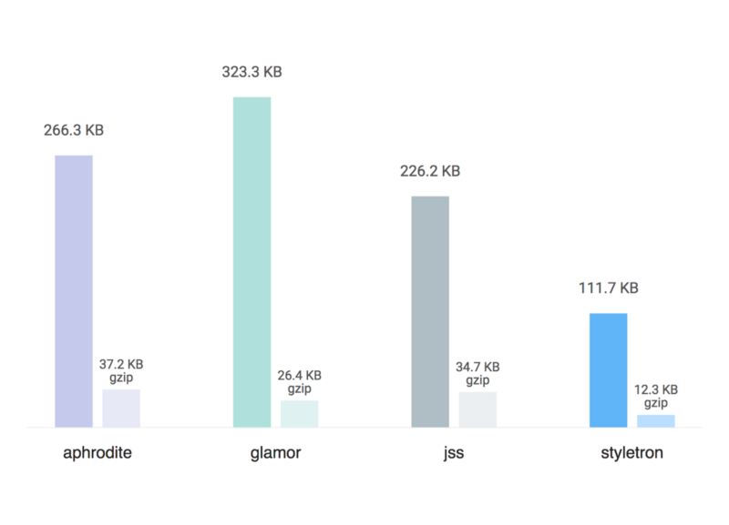
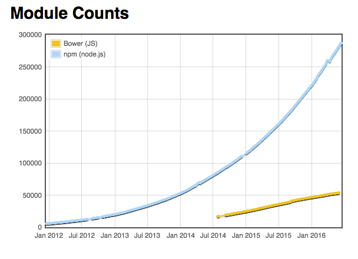
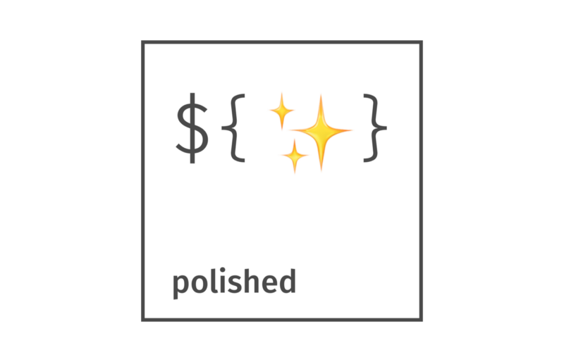
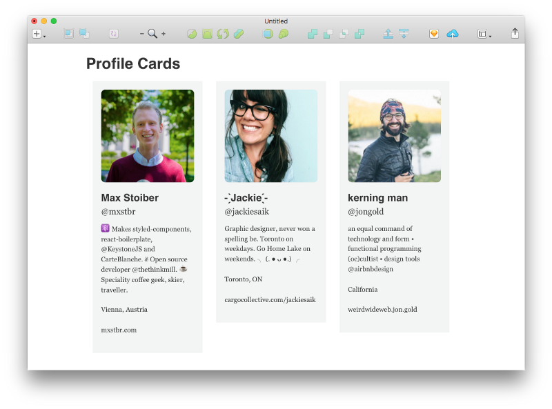

이 글은 [CSS Modules](https://github.com/css-modules/css-modules)의 공동 개발자 Mark Dalgleish의 [A Unified Styling Language](https://medium.com/seek-blog/a-unified-styling-language-d0c208de2660)를 번역한 글입니다.

---

최근 몇년간 [React](https://facebook.github.io/react) 커뮤니티를 중심으로 한 [CSS-in-JS](https://github.com/MicheleBertoli/css-in-js)의 성장이 있었다. 물론 이와 관련한 논쟁 없이 성장하지는 않았다. 많은 사람, 특히 CSS에 친숙한 사람들은 불신의 눈길을 보내왔다.

> 자바스크립트 안에다 CSS를 작성하고 싶은 사람이 있기나 하겠어?
>
> CSS를 이미 배웠다면 그건 정말 끔찍한 아이디어야!

당신이 이런 반응을 가지고 있었다면 이 글을 읽어보길 바란다. 우리가 스타일을 자바스크립트 안에서 작성하는 이유와 그것이 그렇게 끔찍한 아이디어는 아니라는 사실에 대해 살펴보려 한다. 그리고 내가 급속히 성장하고 있는 이 영역에 대해 관심을 두고 있어야 한다고 생각하는 이유에 대해서도 알아볼 예정이다.

## 오해를 받은 커뮤니티

React 커뮤니티와 CSS 커뮤니티는 서로 간에 종종 오해를 사곤 한다. 나는 이 점이 무척 흥미로우며 나는 저 두 영역의 중간 지점 어딘가에 위치하는 입장을 가지고 있다.

나는 90년대말에 HTML을 배우기 시작했고 테이블 기반의 레이아웃을 사용하던 암흑기부터 CSS와 함께해왔다. [CSS Zen Garden](http://www.csszengarden.com/)의 영감을 받아 기존의 코드를 [의미론적(semantic) 마크업](https://en.wikipedia.org/wiki/Semantic_HTML)과 CSS로 옮기는 일의 선두에 서 있었고 얼마 지나지 않아 [겸손한 자바스크립트](https://www.w3.org/wiki/The_principles_of_unobtrusive_JavaScript)를 이용해 서버 렌더링된 마크업을 클라이언트 사이드에서 유저 상호작용을 추가하는 '관심사의 분리'에 사로잡히게 되었다. 이와 관련한 작지만 활발한 커뮤니티가 있었고 브라우저 플랫폼이 응당 받아야 했던 가치를 찾아주기 위해 노력했던 우리는 첫번째 세대의 프론트엔드 개발자가 되었다

이런 웹 중심의 경력을 가지고 있으므로 지금껏 중시하고 있던 원칙에 반하는 React의 [HTML-in-JS](https://facebook.github.io/react/docs/jsx-in-depth.html) 모델에 내가 격렬하게 반대했을 것으로 생각했을지도 모른다. 하지만 실제로는 반대다. 내 경험상 서버 렌더링과 결합한 React의 컴포넌트 모델은 빠르게 배포 가능하고 접근성이 뛰어나며 꾸준히 발전하는 제품을 사용자들에게 제공할 수 있는 확장성을 가진 복잡한 싱글 페이지 앱을 만들 수 있는 길을 마침내 열어 주었다고 본다. 우리는 [SEEK](https://www.seek.com.au/)에서 이 기술을 활용해 가장 중요한 제품을 싱글 페이지 앱으로 만들었으며 핵심 검색 기능은 브라우저의 자바스크립트가 비활성화된 상황에서도 자연스럽게 작동하도록 서버에서 같은 코드를 실행하게 했다.

그러니 이를 한 커뮤니티에서 다른 커뮤니티로 뻗어 있는 올리브나무 가지라고 생각해보자. 이 움직임이 무엇인지 함께 생각해보자. 완벽하지 않을 수 있고 당신이 만들려고 하는 제품에서는 사용하려는 기술이 아닐 수도 있으며 당신을 확실하게 납득시킬 수 없을지도 모른다. 하지만 최소한 고민해 볼 가치는 있다.


## 왜 CSS-in-JS인가?

만약 당신이 내가 최근 React와 함께 작업한 [CSS Modules](https://github.com/css-modules/css-modules)에 친숙하다면 CSS-in-JS를 지지한다는 사실에 놀랄지도 모르겠다.


CSS Modules는 CSS-in-JS를 사용하지 않고 로컬 영역의 스타일시트를 작성하고 싶은 개발자들에게 주로 선택된다. 사실 나는 개인 작업에서 CSS-in-JS를 사용하지도 않는다.

그럼에도 불구하고 나는 CSS-in-JS 커뮤니티에 깊은 관심을 꾸준히 기울이고 있으며 그들이 끊임없이 만들어내는 혁신을 계속 지켜보고 있다. 그뿐만 아니라 *나는 지금보다 더 많은 CSS 커뮤니티들이 관심을 가져야한다고 생각한다.*

왜 그래야 하는가?

사람들이 스타일을 자바스크립트 안에서 작성하기를 원하는 이유를 명확히 이해하기 위해서는 이 접근법을 사용했을 때 얻을 수 있는 실질적인 이익에 대해 살펴봐야 할 것이다.

나는 그 장점을 다섯 가지 영역으로 구분했다:

1. 범위가 지정된(scoped) 스타일
2. 필수적인(critical) CSS
3. 더 똑똑한 최적화
4. 패키지 관리
5. 브라우저가 아닌 환경의 스타일링

CSS-in-JS가 각각의 영역에서 무엇을 제공하는지 자세히 살펴보도록 하자.


## 1.

### 범위가 지정된(scoped) 스타일

CSS를 효율적으로 구조화하는 일이 무척 어렵다는 것은 공공연한 사실이다. 오랫동안 유지된 프로젝트에 참여했을 때 CSS가 가장 파악하기 어려운 부분이라는 건 친숙한 사실이다.

이 문제를 해결하기 위해 CSS 커뮤니티는 많은 노력을 했다. Nicole Sullivan의 [OOCSS](https://github.com/stubbornella/oocss/wiki)나 Jonathan Snook [SMACSS](https://smacss.com/) 같은 방법론을 이용해 스타일의 유지보수를 보다 쉽게 만들려는 시도를 해 왔다. 하지만 현재 시점에서 인기도에 의하면 확실한 승자는 Yandex의 Block Element Modifier라고도 불리는 [BEM](http://getbem.com/)이다.

궁극적으로 BEM은 (CSS에만 적용되었을 경우) 스타일의 클래스를 `.Block__element--modifier` 패턴으로 제한함으로써 최적화를 이루려고 하는 이름 만들기 규칙(naming convention)이다. BEM 스타일의 코드베이스에서 개발자는 항상 BEM의 규칙을 따르려고 해야 한다. 엄격하게 규칙을 따랐을 경우 BEM은 아주 잘 작동한다. 그런데작업 왜 범위 지정이라는 근본적인 작업이 단지 *규칙* 하나에만 의존해야 하는가?

그들이 확실히 말하든 아니든 대부분의 CSS-in-JS 라이브러리들은 BEM 기반의 사고방식을 따르면서 각각의 UI에 스타일을 지정하려고 한다. 하지만 내부적으로는 서로 다른 방식으로 구현하고 있다.

실제로 어떻게 구현하고 있을까? Sunil Paid의 [glamor](https://github.com/threepointone/glamor)를 사용할 경우 코드는 아래와 같이 작성한다.

```javascript
import { css } from 'glamor'

const title = css({
  fontSize: '1.8em',
  fontFamily: 'Comic Sans MS',
  color: 'blue'
})

console.log(title)
// → 'css-1pyvz'
```

이 코드에서 *CSS 선택자(selector)는 어디에도 존재하지 않는다*는 사실을 확인할 수 있다. 직접 선언된 선택자 레퍼런스는 존재하지 않는 대신 라이브러리가 자동으로 만들어준다. 라이브러리가 레퍼런스를 관리하므로 전역에서 클래스 이름이 충돌할 일이 없다는 것은 우리가 직접 클래스에 BEM과 같은 규칙을 바탕으로 접두어를 붙일 필요가 없다는 말과 같다.

이 선택자의 범위(scope)는 주변 코드의 범위 규칙을 따른다. 만약 코드가 모듈화되어 있고 이 선택자들을 앱의 다른 영역에서 사용하고 싶다면 자바스크립트 모듈로 변환한 후 필요한 곳에서 import로 불러오면 된다. 모듈화된 선택자를 사용해서 *어떤 코드에서도 주어진 스타일을 쉽게 추적할 수 있다는 사실*은 코드 베이스를 지속해서 유지 보수성이 있게 한다는 측면에서 무척 강력하다.

***단순한 규칙의 사용에서 스타일의 범위가 기본적으로 지정되도록 강제하는 방향으로 나아감으로써 스타일 코드의 기본 품질을 향상했다. 이로써 BEM은 선택 가능한 옵션(opt-in)에서 시스템에 포함된(baked-in) 규칙이 되었다.***

--

여기서 더 진행하기 전에 명확하게 하고 넘어가야 할 매우 중요한 사항이 있다.

***인라인(inline) 스타일이 아닌 CSS 직접 생산한다는 점이다.***

초기에 대부분의 CSS-in-JS 라이브러리들은 각각의 요소에 스타일을 직접 붙이는 방식을 사용했다. 하지만 이 방식의 큰 결점은 그 '스타일' 속성이 CSS가 할 수 있는 모든 것을 할 수 없다는 점이다. 새로운 라이브러리들은 과거의 방식을 사용하는 대신 런타임에서 전역에 스타일을 추가하고 제거하는 *동적인 스타일 시트*의 사용에 집중하고 있다.

한 예로서 CSS를 생성하는 초기의 CSS-in-JS 라이브러리 중 하나인 Oleg Slobodskoi의 [JSS](https://github.com/cssinjs/jss)를 살펴보자.


JSS를 사용할 경우 hover나 미디어쿼리같은 표준 CSS 규칙으로 대응되는 문법을 사용할 수 있다.

```javascript
const styles = {
  button: {
    padding: '10px',
    '&:hover': {
      background: 'blue'
    }
  },
  '@media (min-width: 1024px)': {
    button: {
      padding: '20px'
    }
  }
}
```

이 스타일을 도큐먼트에 추가하면 자동으로 생성된 스타일이 제공된다.

```javascript
const { classes } = jss.createStyleSheet(styles).attach()
```

생성된 선택자들은 자바스크립트 안에서 마크업을 작성할 때 직접 작성된 선택자 대신 사용될 수 있다. 이 패턴은 제대로 된 구조나 innerHTML같은 간단한 방법에 상관없이 잘 작동한다.

```javascript
document.body.innerHTML = `
 <h1 class="${classes.heading}">Hello World!</h1>
`
```

스타일을 이렇게 관리하는 방식은 그 자체로서 컴포넌트 라이브러리들과 잘 결합한다는 약간의 장점이 있다. 그 결과로서 이 방식이 대부분의 인기있는 라이브러리와 결합한 형태를 쉽게 발견할 수 있다. 예를 들면 JSS는 [react-jss](https://github.com/cssinjs/react-jss)의 도움의 받아 전역 스타일을 관리하면서 필요한 부분을 조금씩 컴포넌트로 주입하는 방식으로 React 컴포넌트와 쉽게 결합할 수 있다.

```jsx
import injectSheet from 'react-jss'

const Button = ({ classes, children }) => (
 <button className={classes.button}>
   <span className={classes.label}>
    {children}
   </span>
 </button>
)

export default injectSheet(styles)(Button)
```

컴포넌트와 관련된 스타일에 집중함으로써 스타일이 코드 레벨에서 더 밀접하게 통합되며 사용자는 효과적으로 BEM을 논리적인 결론으로 받아들인다. 그런데 스타일과 컴포넌트가 너무 강하게 연결되어 있으므로 CSS-in-JS 커뮤니티의 많은 사람은 스타일 추출, 명칭, 컴포넌트의 재사용이 가지는 중요성을 놓치고 있다고 느꼈다.

이 문제를 완전히 새로운 방식으로 접근한 방법은 Glen Maddern과 Max Stoiber의 [styled-components](https://github.com/styled-components/styled-components)의 등장과 함께 나타났다.


스타일시트를 생성하는 대신 컴포넌트에 스타일이 직접 연결된 형태로 만들도록 강제한다.

```javascript
import styled from 'styled-components'

const Title = styled.h1`
  font-family: Comic Sans MS;
  color: blue;
`
```

이 스타일을 적용할 때는 기존의 요소에 클래스를 붙이지 않는다. 생성된 컴포넌트를 단순히 렌더링한다.

```html
<Title>Hello World!</Title>
```

styled-components가 tagged template literals를 이용해 전통적인 CSS 문법을 사용하는 대신 다른 라이브러리들은 별도의 데이터 구조를 사용한다. 주목할만한 대안은 PayPal의 Kent C. Dodds가 만든 [Glamorous](https://github.com/paypal/glamorous)다.


Glamorous는 styled-components처럼 컴포넌트 우선 API를 제공한다. 하지만 *문자열*대신 *객체*를 사용해서 라이브러리가 CSS 문법 분석기(parser)를 사용할 필요가 없도록 했으며 그 결과 라이브러리의 크기와 성능 지표를 향상했다.

```javascript
import glamorous from 'glamorous'

const Title = glamorous.h1({
  fontFamily: 'Comic Sans MS',
  color: 'blue'
})
```

어떤 문법을 사용하든 이 두 방식으로 만들어진 스타일은 범위가 지정되어 있지 않다. *그들은 컴포넌트와 결코 분리될 수 없다*. React 같은 라이브러리를 사용할 때 컴포넌트는 기본적인 구성 요소이며 이제 우리의 스타일은 그것의 일부가 되었다. *만약 앱의 모든 것을 컴포넌트로 표현한다면, 스타일이라고 그러지 않을 이유가 있는가?*

--

BEM에 아주 능숙한 베테랑이라면 이 모든 것들은 우리의 시스템에 도입된 변화의 중요성을 고려했을 때 상대적으로 미약한 변화라고 느낄 수 있다. 사실 CSS Modules는 이를 지금 누리고 있는 CSS 개발 도구 생태계를 유지하면서도 얻을 수 있게 해준다. 이것이 많은 프로젝트가 친숙한 표준 CSS를 버리지 않고도 선택자 충돌 같은 문제를 효과적으로 해결할 수 있고 확장성도 있는 CSS를 작성할 수 있도록 도와주는 CSS Modules를 계속 사용하고 있는 이유이기도  하다.

하지만, 이제는 지금까지의 기본적인 개념들을 기반으로 더 흥미로운 일을 시도할 때가 되었다.


## 2.

### 필수적인(critical) CSS

현재 페이지를 렌더링하는 데 필요한 필수적인 스타일을 도큐먼트 헤드에 추가해서 최초 로딩 시간을 향상하는 방법은 비교적 최근의 모범 사례다. 이는 브라우저가 단 하나의 픽셀도 화면에 렌더링하기 전에 가능한 모든 시각적인 스타일을 불러오도록 강제하는 일반적인 스타일 로딩 방식과는 뚜렷하게 대조적이다.

필수적인 CSS를 추출하고 인라인에 적용하는 Addy Osmani의 [critical](https://github.com/addyosmani/critical)이라는 도구가 있긴 하다. 하지만 필수적인 CSS를 유지하면서 자동화하기 어렵다는 사실을 근본적으로 바꾸지는 않는다. 이는 까다롭고 순수하게 선택적인 성능 최적화 과정이기 때문에 대부분의 프로젝트가 이 과정을 생략한다.

CSS-in-JS는 완전히 다르다.

서버 렌더링 된 앱을 개발할 때 필수적인 CSS를 추출하는 일은 단순히 최적화 과정이 아니다. CSS-in-JS는 기본적으로 필수적인 CSS가 우선해서 작동하도록 *요구한다*.

예를 들어 Khan Academy의 [Aphrodite](https://github.com/Khan/aphrodite)를 사용하면 클래스를 요소에 적용할 때 인라인에서 사용되는 `CSS` 함수가 각각의 렌더링 과정에서 어떤 스타일이 사용되었는지 계속 추적한다.


```jsx
import { StyleSheet, css } from 'aphrodite'

const styles = StyleSheet.create({
  title: { ... }
})

const Heading = ({ children }) => (
  <h1 className={css(styles.title)}>{ children }</h1>
)
```

모든 스타일이 자바스크립트에서 선언되어 있지만, 현재 페이지에 필요한 모든 스타일을 정적인 문자열로 구성된 CSS로 쉽게 추출할 수 있고 서버 사이드 렌더링 시 도큐먼트의 head에 삽입할 수 있다.

```jsx
import { StyleSheetServer } from 'aphrodite';

const { html, css } = StyleSheetServer.renderStatic(() => {
  return ReactDOMServer.renderToString(<App/>);
});
```

이제 필수적인 CSS 블록을 아래와 같은 방식으로 렌더링할 수 있다.

```javascript
const criticalCSS = `
 <style data-aphrodite>
  ${css.content}
 </style>
`;
```

React의 서버 렌더링 모델을 살펴보았다면 이는 무척 익숙한 패턴일 것이다. React에서 컴포넌트는 마크업을 자바스크립트 안에서 선언하지만, 서버에서 표준 HTML 문자열로 렌더링 될 수 있다.

***만약 점진적 향상(progressive enhancement)을 염두에 두고 앱을 개발한다면 완전히 자바스크립트로 작성되었음에도 클라이언트 사이드에서 자바스크립트는 전혀 필요 없을 수도 있다.***

어느 방법이든 클라이언트 사이드 자바스크립트는 당신의 싱글 페이지 앱(SPA, single-page app)을 시작하기 위한 코드 묶음(bundle)이 필요하며, 어느 순간 갑자기 불려서 활성화된 후 브라우저 렌더링을 시작한다.

서버상에서는 HTML과 CSS의 렌더링은 동시에 이루어지기 때문에 Aphrodite 같은 라이브러리는 앞서 살펴보았듯이 한 번의 호출을 통해 필수적인 CSS와 서버 렌더링 된 HTML을 능률적으로 생성할 수 있도록 도와준다. 이는 우리가 비슷한 방법으로 React 컴포넌트를 정적인 HTML로 렌더링할 수 있게 해준다.

```jsx
const appHtml = `
  <div id="root">
    ${html}
  </div>
`
```

CSS-in-JS를 서버에서 사용함으로써 싱글 페이지 앱이 자바스크립트 없이 작동하도록 할 뿐만 아니라 *더 빠르게 렌더링해줄 수 있다*.

***선택자의 범위 지정과 마찬가지로 필수적인 CSS를 렌더링하는 모범 사례는 이제 선택 가능한 옵션에서 시스템에 포함된 요소가 되었다.***


## 3.

### 더 똑똑한 최적화

최근 새로운 방식으로 CSS를 구성하는 방법들이 떠오르고 있다. Yahoo의 [Atomic CSS](https://acss.io/)나 Adam Morse의 [Tachyons](http://tachyons.io/) 같은 라이브러리는 좁은 목적을 가진 작은 "의미론적 클래스"의 사용을 삼가는 방식을 사용한다. 예를 들어 Atomic CSS를 사용할 경우 적절한 스타일 시트를 생성하기 위해 함수 같은 방식의 문법을 사용해서 클래스를 적용한다.

```html
<div class="Bgc(#0280ae.5) C(#fff) P(20px)">
 Atomic CSS
</div>
```

목표는 CSS 번들을 가능한 낭비가 없게(lean) 만들어서 클래스의 재활용성을 극대화하고 클래스를 인라인 스타일처럼 효과적으로 사용하는 것이다. 파일의 크기가 줄어든다는 장점은 쉽게 파악될 수 있지만 당신의 코드베이스와 동료들에게 미치는 영향은 크지 않다. 이 최적화는 CSS와 마크업에 근본적인 영향을 미치며 구조 설계에 더 많은 노력을 기울이도록 한다.

앞서 다루었듯이 CSS-in-JS나 CSS Modules를 사용하면 마크업에서 클래스 문자열을 직접 입력할 필요가 없다. 대신 라이브러리나 빌드 도구에 의해 자동 생성된 값에 대한 동적인 참조를 사용한다.

이런 코드 대신:

```html
<aside className="sidebar" />
```

이렇게 코드를 작성한다:

```html
<aside className={styles.sidebar} />
```

이는 아주 큰 변화처럼 보인다. 하지만 이 변화는 우리가 마크업과 스타일 간의 관계를 관리하는 방식에 대한 기념비적인 변화다. CSS 개발 도구에 스타일을 변경하는 능력뿐만 아니라 요소에 적용하는 클래스까지 관리하는 능력을 줌으로써 스타일 시트의 클래스를 최적화활 수 있는 완전히 새로운 방식을 열었다고 할 수 있다.

위의 코드를 살펴보면 `styles.sidebar`는 문자열로 변환되지만 하나의 클래스만 사용하라는 제한은 없다.  복수의 클래스를 지정하는 일은 무척 쉽게 가능해질 수 있다.

```html
<aside className={styles.sidebar} />

<!-- 아래의 코드로 간단히 변환 가능하다: -->

<aside className={'class1 class2 class3 class4'} />
```

각각의 스타일에 대해 복수의 클래스를 생성하는 방식으로 스타일을 최적화한다면 아주 흥미로운 일들이 가능해진다.

이와 관련해 내가 가장 좋아하는 사례는 Ryan Tsao의 [Styletron](https://github.com/rtsao/styletron)이다.


CSS-in-JS와 CSS Modules가 BEM 스타일의 클래스 접두사를 자동으로 붙여주는 것처럼 Styletron은 Atomic CSS와 같은 방식을 사용한다.

코어 API는 각각의 속성, 값, 미디어쿼리의 조합에 대한 CSS 규칙을 정의한 후 자동 생성된 클래스를 반환하는 한 가지 작업에 초점을 맞추고 있다.

```javascript
import styletron from 'styletron';

styletron.injectDeclaration({
  prop: 'color',
  val: 'red',
  media: '(min-width: 800px)'
});

// → 'a'
```

물론 Styletron은 더 높은 레벨의 API도 제공한다. `injectStyle` 함수를 사용하면 복수의 규칙을 한 번에 정의할 수 있다.

```javascript
import { injectStyle } from 'styletron-utils';
injectStyle(styletron, {
 color: 'red',
 display: 'inline-block'
});
// → 'a d'
injectStyle(styletron, {
 color: 'red',
 fontSize: '1.6em'
});
// → 'a e'
```

위의 코드에서 생성된 두 세트의 클래스 이름들 사이의 공통성을 확인해보라. (역주: `color: 'red'` 규칙은 `a` 라는 클래스를 공통으로 사용하도록 최적화되었다)

클래스 자체의 이름을 관리하는 낮은 레벨의 작업을 포기하고 단지 필요한 스타일을 작성하기만 함으로써 라이브러리는 우리에게 이득이 되는 최적화된 작은 단위의(Atomic) 클래스들을 생성할 수 있다.



CSS 최적화는 보통 작성한 스타일을 가장 효율적으로 재활용이 가능한 클래스들로 분리하는 순수 수작업으로 이루어지곤 한다. 하지만 이제는 라이브러리에 의해 완전히 자동화가 가능해졌다. 당신은 이 트렌드를 주목하기 시작할 필요가 있다. ***Atomic CSS는 이제 선택 가능한 옵션에서 시스템에 포함된 요소가 되었다.***


## 4.

### 패키지 관리

이 주제에 대해 알아보기 전에 먼저 자신에게 간단해 보이는 질문을 해볼 필요가 있을 것이다.

*우리는 CSS를 어떻게 서로에게 공유하는가?*

수동으로 내려받은 CSS 파일을 사용하던 시절에서 [Bower](https://bower.io/)같은 프론트엔드 중심의 패키지 매니저 사용하던 시기를 지나 이제는 Browserify나 webpack 같은 도구 덕분에 npm을 통해 코드를 공유한다. 몇몇 도구가 외부 패키지에서 CSS를 가져오는 과정을 자동화했지만 프론트엔드 커뮤니티에서는 여전히 외부 CSS를 수동으로 관리하는 단계에 머물러 있다.

자동화와 수동 어느 쪽이든 공유한 라이브러리별로 서로 *다른* CSS 의존성에 기대고 있으므로 좋지 않다.

많은 이들이 기억하겠지만 Bower와 npm의 *자바스크립트 모듈*에서 비슷한 사례가 발생했던 일이 있다.

npm에 배포된 모듈이 [CommonJS 모듈 형식](http://wiki.commonjs.org/wiki/Modules/1.1)을 사용한것에 비해 Bower는 어떠한 모듈 형식과도 결합되지 않았다. 이는 결과적으로 각각의 플랫폼에 배포된 패키지 수에 아주 큰 영향을 미쳤다.

npm은 작고 중첩된 의존성을 가지지만 Bower는 몇 개의 플러그인만 사용해도 크고 거대한 의존성을 가지게 된다. 당신의 의존성이 모듈 시스템에 의존하지 않는다면 각각의 패키지는 의존성을 제대로 사용할 수 없게 된다. 결국 패키지에게 필요한 의존성을 해결하는 일은 항상 사용자에게 넘겨진다.

결과적으로 npm의 패키지 수의 그래프는 지수 형태를 그렸지만 bower의 패키지 수는 선형적으로 증가했다. 이 차이에는 여러가지 이유가 있긴 하지만 결정적인 요인은 각각의 플랫폼이 패키지가 런타임에서 서로서로 의존할 수 있도록 해주느냐 아니냐의 차이에서 왔다고 할 수 있을 것이다.



Bower의 패키지 수 증가율은 안타깝게도 CSS 커뮤니티에게는 너무나 친숙한 모습이다. npm의 자바스크립트 패키지 비해 CSS 패키지 수의 증가율은 상대적으로 느렸기 때문이다.

CSS 패키지도 npm의 지수 그래프처럼 되길 바란다면? 모든 것을 포함한 프레임워크가 아닌, 다양한 사이즈를 가지고 있으며 복잡한 의존성 계층을 가진 패키지들을 사용하고 싶다면 어떻게 해야 할까? 이를 위해서는 단지 패키지 관리자만이 아니라 CSS를 위한 적절한 모듈 포맷이 필요하다.

이는 CSS를 대상으로 디자인된 패키지 매니저가 필요하다는 의미인가? Sass와 Less를 위한 전처리기(preprocessor)처럼?

흥미롭게도 우리는 이미 HTML을 통해 유사한 깨달음을 얻은 적이 있다.

```javascript
const styles = {
  ...rules,
  ...moreRules,
  fontFamily: 'Comic Sans MS',
  color: 'blue'
}
```

이 방식으로 스타일을 작성하기 시작한다면 앱의 다른 코드처럼 같은 패턴, 같은 도구, 같은 기반 구조, 같은 *생태계*(ecosystem)를 사용하면서 얼마든지 스타일 코드를 조합하고 공유할 수 있다.

이 방법이 어떻게 성과를 거두는지 좋은 사례로는 Max Stoiber와 Nik Graf, Brian Hough의 [Polished](https://github.com/styled-components/polished)가 있다.



Polished는 믹스인, 컬러 함수, 약칭 등의 완벽한 컬렉션을 제공하는 CSS-in-JS의 [Lodash](https://lodash.com/)라고 할 수 있다. Sass 같은 언어를 사용하던 사람들에게 자바스크립트 안에서 스타일을 보다 친숙하게 작성할 수 있도록 도와준다. 핵심적인 차이는 Sass보다 조합, 공유, 테스트에 있어 더 뛰어나며 자바스크립트 패키지 생태계를 마음껏 사용할 수 있다는 점이다.

그래서, CSS의 경우 어떻게 작고 재사용성이 있는 패키지를 조합하여 거대한 스타일 컬렉션을 구성하는, 자바스크립트와 같은 수준의 오픈소스 활동을 기대할 수 있을까? CSS를 다른 언어에 내장하고 자바스크립트 모듈을 최대한 활용하는 방법을 통해 가능할 것이다.


## 5.

### 비 브라우저 스타일

지금껏 살펴본 내용은 ~CSS를 자바스크립트 안에서 작성하는 편이 확실히 쉬운데도 불구하고~ 표준 CSS가 없다면 불가능하다. 내가 가장 흥미롭고 미래지향적인 이 주제를 맨 뒤로 미뤄둔 이유가 여기에 있다. 이 주제는 오늘날의 CSS-in-JS 커뮤니티에서는 꼭 중요한 위치를 차지하고 있을 필요는 없지만, 미래의 *디자인*에서는 기반 기술이 될 가능성이 꽤 있다. 개발자뿐만 아니라 디자이너에게도 영향을 미치는 이 기술은 이 두 분야가 서로 의사소통을 하는 방식을 근본적으로 바꾼다.

본격적으로 얘기하기에 앞서 우선 React에 대해 잠시 빠르게 훑어보고 지나갈 필요가 있다.

--

React 모델은 최종값을 즉시 렌더링하는 컴포넌트에 관한 모든 것이다. 브라우저에서 작업할 때는 DOM 요소를 직접 조작하기보다는 복잡한 트리 구조의 가상 DOM을 구성하게 된다.

이런 중요도에도 불구하고 DOM을 렌더링하는 기능을 React의 코어 라이브러리가 아닌 *react-dom*에서 제공한다는 사실은 무척 흥미롭다.


```javascript
import { render } from 'react-dom'
```

React가 DOM을 위해 만들어졌고 브라우저 환경에서 가장 많이 사용되고는 있긴 하다. 하지만 React 모델은 새로운 렌더러를 도입함으로써 매우 다양한 환경에서 사용될 수 있다.

JSX는 단지 가상(virtual) DOM에 관한 것만이 아니다 - JSX는 *무엇이든* 가상으로 만들 수 있다.

네이티브 앱을 만들 수 있는 [React Native](https://facebook.github.io/react-native)가 그런 방식이다. 자바스크립트로 컴포넌트를 작성하면 iOS이나 Android 네이티브에 대응하는 가상 요소를 렌더링한다. 예를 들면 *div*와 *span* 대신 *View*와 *Text*를 렌더링하는 식이다.

CSS의 관점에서 React Native에서 가장 흥미로운 건 자체적으로 [StyleSheet API](https://facebook.github.io/react-native/docs/stylesheet.html)를 가지고 있다는 점이다.

```javascript
var styles = StyleSheet.create({
  container: {
    borderRadius: 4,
    borderWidth: 0.5,
    borderColor: '#d6d7da',
  },
  title: {
    fontSize: 19,
    fontWeight: 'bold',
  },
  activeTitle: {
    color: 'red',
  }
})
```

친숙한 스타일들을 확인할 수 있을 것이다. 위의 코드에서는 색상, 폰트, 보더 스타일을 정의하고 있다.

이 규칙들은 무척 직관적이며 대부분의 UI 환경에 쉽게 대응되지만 네이티브 레이아웃을 사용할 때 가장 재밌어진다.

```javascript
var styles = StyleSheet.create({
  container: {
    display: 'flex'
  }
})
```

브라우저가 아님에도 불구하고 *React Native는 [flexbox](https://developer.mozilla.org/en-US/docs/Web/CSS/CSS_Flexible_Box_Layout/Using_CSS_flexible_boxes)를 네이티브 환경에서 사용할 수 있는 구현체를 탑재하고 있다*.

최초 배포시 [css-layout](https://www.npmjs.com/package/css-layout)이라고 불렸던 자바스크립트 패키지는 flexbox를 자바스크립트만으로 구현했고(종합적인 테스트 코드가 뒷받침하고 있다) 지금은 더 나은 이식성을 위해 C로 이식되었다.

그리고 프로젝트의 범위와 중요성을 고려해서 Yoga라는 이름의 더 의미 있는 브랜드를 부여받은 상태다.


Yoga는 CSS 콘셉트를 비 브라우저 환경으로 이식하는 프로젝트지만 CSS의 일부분만을 대상으로 하고 있기 때문에 잠재적으로 관리 불가능한 영역이 존재한다.

> "Yoga는 CSS의 완전한 구현이 아닌 풍부한 레이아웃 라이브러리의 구현에 초점을 맞추고 있다."

이런 상충관계는 한계를 가지고 있는 것처럼 보인다. 하지만 CSS 구조의 역사를 살펴보면 확장성있는 CSS를 작성하는 일은 결국 CSS라는 언어 속에서 적합한 부분집합을 선택하는 일과 같다는 사실을 명백히 알 수 있을 것이다.

Yoga의 경우 범위가 지정된 스타일의 중첩을 피하고 레이아웃 엔진을 전적으로 flexbox에 집중한다. 이는 많은 기능을 사용할 수 없게 하지만 스타일이 탑재된 컴포넌트를 복수의 플랫폼에서 사용할 수 있다는 놀라운 기회를 열어준다. 그리고 이미 이 사실을 입증하는 주목할만한 오픈소스 프로젝트들이 여럿 있다.

Nicolas Gallagher의 [React Native for Web](https://github.com/necolas/react-native-web)은 React Native의 드랍 인(drop-in) 대체에 목표를 맞추고 있다. webpack 같은 번들러를 사용할 때 서드파티 플러그인에 별칭을 붙이는 방식은 무척 직관적이다.

```javascript
module: {
  alias: {
    'react-native': 'react-native-web'
  }
}
```

React Native for Web은 React Native 컴포넌트를 브라우저 환경에서 사용할 수 있게 하며, [React Native StyleSheet API](https://facebook.github.io/react-native/docs/stylesheet.html)의 브라우저 이식 버전도 포함하고 있다.

유사한 사례로 Leland Richardson의 [react-primitives](https://github.com/lelandrichardson/react-primitives)는 타깃 플랫폼의 상세 구현을 추상화함으로써 크로스 플랫폼 기본 컴포넌트의 실행 가능한 베이스라인을 만든다.

심지어 마이크로소프트도 [ReactXP](https://microsoft.github.io/reactxp)를 소개하며 이 흐름에 동참하고 있다. 웹과 네이티브간의 코드 공유를 위한 수고를 덜 수 있도록 디자인되었으며 [플랫폼 독립적(platform-agnostic)인 스타일 구현](https://microsoft.github.io/reactxp/docs/styles.html)도 포함하고 있다.

--

당신이 네이티브 앱을 개발하지 않는다 하더라도 크로스 플랫폼 컴포넌트 추상화는 우리에게 사실상 제한이 없는 환경, 또는 전혀 상상하지 못했던 방식을 선택할 수 있도록 해준다는 점에서 꼭 주목해야 한다.

이와 관련해서 내가 지금껏 봤던 가장 놀라운 사례는 Airbnb의 Jon Gold가 만든 [react-sketchapp](http://airbnb.io/react-sketchapp)이다.


우리 중 많은 사람은 시스템에서 가능한 중복이 없게 할 목적으로 디자인 언어를 표준화하는 일에 많은 시간을 할애한다. 불행히도 단 하나의 소스(single source of truth)만 가지고 싶지만, 현실적으로 줄일 수 있는 최선은 2개-개발자를 위한 디자인 가이드와 *디자이너를 위한 정적인 스타일 가이드*다. 예전에 비하면 많이 좋아진 편이지만 여전히 Sketch같은 디자인 도구를 수동으로 동기화시켜야 한다. 그런 이유에서 react-sketchapp이 등장했다.

Sketch의 [자바스크립트 API](http://developer.sketchapp.com/reference/api)와 React의 브라우저가 아닌 다른 플랫폼으로 렌더링할 수 있는 능력 덕분에 react-sketchapp은 크로스 플랫폼 React 컴포넌트를 Sketch 문서로 렌더링해준다.



말할 필요도 없이, 이것은 디자이너와 개발자가 협력할 수 있는 방식을 완전히 바꿔버릴 수 있는 잠재력이 있다. 이제 디자인에서 반복적으로 사용되는 컴포넌트를 언급할 때 디자이너와 개발자가 각각 어떤 도구를 사용하든 같은 컴포넌트를 참조할 수 있게 될 것이다.

우리의 업계는 Sketch의 symbols과 React의 컴포넌트와 함께 기본적으로 같은 추상화에 도달하기 시작했다. 이는 같은 도구를 공유하면서 더 긴밀히 협업할 가능성을 열어줄 것이다.


---

많은 새로운 실험들이 React 커뮤니티와 그 주변에서 이루어지고 있다는 건 우연이 아니다.

컴포넌트 기반 구조에서는 특정 컴포넌트와 관련된 요소들을 최대한 같은 위치에 두는 일에 높은 우선순위를 둔다. 물론 여기에는 로컬 범위를 가진 스타일도 포함되며 [Relay](https://facebook.github.io/relay)나 [Apollo](http://dev.apollodata.com/) 덕분에 데이터 가져오기와 같은 복잡한 영역까지 확장된다. 이는 엄청난 잠재력을 가진 무언가의 봉인을 해제한 것과 비슷하며 우리는 아직 그것의 일부분만 확인했을 뿐이다. 그것은 우리의 앱을 스타일링하는 방법뿐만 아니라 구조적으로도 전반적인 영역에 커다란 영향을 미치겠지만, 긍정적인 영향일 것이다.

하나의 언어로 작성된 컴포넌트 관련 모델을 통합함으로써 기술이 아닌 *기능성*을 바탕으로 관심사를 더 잘 분리할 가능성이 생겼다. 컴포넌트와 관련된 모든 것의 범위를 지정하고, 최적화된 방법으로 유지보수가 가능한 한 큰 규모로 확장하고, 작업 결과물을 쉽게 공유하고, 작은 오픈소스들로 큰 규모의 앱을 조합하는 일은 예전에는 가능하지 않았다. 그리고 이 모든 일은 현재 타협 불가능하다고 여겨지는 기존의 웹 플랫폼 개발 원칙들을 버리는 것처럼 급진적인 변화 없이 가능하다는 사실이 가장 중요하다.

나는 새로운, *통합 스타일링 언어*의 기반을 구성할 단일 언어로 작성된 컴포넌트가 가져올 가능성이 무척 기대된다. 통합 스타일링 언어는 우리가 지금껏 보지 못한 방식으로 프론트엔드 커뮤니티를 통합할 수 있다.

---

SEEK에서는 통합 스타일링 언어의 장점을 활용하기 위해 컴포넌트 모델과 관련된 자체적인 스타일 가이드를 만들고 있다. 그것은 의미론적이고 상호작용성과 시각 스타일링이 모두 하나의 추상화 안에 통합되어 있다. 이것은 개발자와 디자이너가 공유할 수 있는 일반적인 디자인 언어를 구성한다.

페이지를 만드는 일은 작업물이 특징을 가진 컴포넌트를 조합하는 것처럼 간단하면서도 품질을 유지할 수 있어야 한다. 또 제품이 출시된 후에도 디자인 언어를 업그레이드할 수 있어야 한다.

```jsx
import {
  PageBlock,
  Card,
  Text
} from 'seek-style-guide/react'

const App = () => (
  <PageBlock>
    <Card>
      <Text heading>Hello World!</Text>
    </Card>
  </PageBlock>
)
```

비록 지금은 스타일 가이드가 React, webpack과 CSS Modules로 만들어져 있지만 이 구조는 CSS-in-JS로 만들어진 시스템에서 볼 수 있는 구조를 그대로 반영했다. 선택한 기술은 다를 수 있지만 사고방식은 같다.

하지만 현재의 선택은 향후 예상하지 못한 방법으로 변경해야 할 가능성이 있기에 우리의 컴포넌트 생태계에서 진행 중인 진화를 주의 깊게 지켜보는 일이 무척 중요하다. 지금은 CSS-in-JS를 사용하지 않을 수 있지만, 앞으로는 그 방법으로 바꿔야 할 설득력 있는 이유가 생각보다 빠르게 등장할 가능성이 무척 크다.

---

CSS-in-JS는 짧은 시간 만에 놀라울 정도로 큰 변화를 만들어냈지만 큰 틀에서는 단지 시작일 뿐이라는 사실을 주목해야 한다.

여전히 발전의 여지가 많으며 혁신은 멈출 기미가 보이지 않는다. 주목할만한 이슈를 제시하며 개발자 경험을 향상할 라이브러리는 계속해서 등장하고 있다. 성능 향상, 정적 CSS를 빌드시점에서 추출하기, CSS 변수 사용 등과 함께 프론트엔드 개발에 입문하는 사람들의 진입 장벽을 낮추기 위한 시도는 계속되고 있다.

여기가 CSS 커뮤니티가 필요한 지점이다. 작업 방식의 이 거대한 변화에도 불구하고 ***그 어떤 것도 CSS를 제대로 알아야 할 필요가 있다는 사실은 바꾸지 못한다.***

다른 방식으로 문법을 표현할 수도 있고 앱을 다른 방식으로 구성할 수도 있지만 근본적인 구성 요소인 CSS는 사라지지 않는다. 마찬가지로 우리의 업계가 컴포넌트 구조로 나아가는 흐름은 불가피하며 이 렌즈를 통해 프론트엔드를 다시 생각해보고 싶은 욕구는 더 강해지고 있다. 우리의 솔루션이 디자인이나 공학, 또는 양쪽 모두의 배경을 가진 개발자들에게 널리 활용될 수 있도록 CSS와 JS 커뮤니티가 함께해야 할 필요가 있다.

그것이 때로는 어려울 수도 있겠지만, CSS와 JS 커뮤니티는 모두 프론트엔드의 진보를 바라는 열정을 공유하고 있다. 웹 플랫폼을 진지하게 대하며 다음 세대의 웹 사이트를 위한 프로세스를 개선하길 바란다. 여기에는 너무나 큰 가능성이 있고 지금까지도 많은 것들을 이뤄냈지만 여전히 해야 할 일들이 많이 남아 있다.

---

여기까지 읽은 당신은 여전히 확신을 얻지 못했을 수도 있지만, 괜찮다. *지금 당장*은 CSS-in-JS가 당신이 지금 진행 중인 작업에 확실히 부적합할 수 있다. 하지만 나의 희망은 그것이 단지 문법에 대한 피상적인 거부감이 아닌 *적합한 이유*이길 바랄 뿐이다.

그런데도 이 스타일을 제작에 대한 이 접근법은 향후 몇 년간 더 많은 인기를 끌고야 말 것이다. 그리고 빠르게 성장하는 이 접근법을 꾸준히 눈여겨봐야 할 가치가 있다. 나는 당신이 모든 프론트엔드 개발자에게 유용할 차세대 CSS 개발 도구를 만드는 과정에 코드로 기여하거나, *대화에 활발히 참여하는 방식*을 사용해서라도 참여하기를 진심으로 바란다. 그것이 어렵다면 *최소한* 내 글이 사람들이 이 일에 왜 그렇게 열정적으로 참여하는지, 왜 그렇게 터무니없는 생각만은 아닌지를 이해하는 데 도움이 되었길 바란다.

---

이 글은 독일 베를린에서 개최된 CSSconf EU 2017에서 발표된 같은 제목을 가진 세션과 함께 작성되었다. 영상은 [Youtube에서 시청할 수 있다](https://www.youtube.com/watch?v=X_uTCnaRe94).

<div width:>
<iframe style="display: block; margin: 0 auto;" width="560" height="315" src="https://www.youtube.com/embed/X_uTCnaRe94" frameborder="0" allowfullscreen></iframe>
</div>

