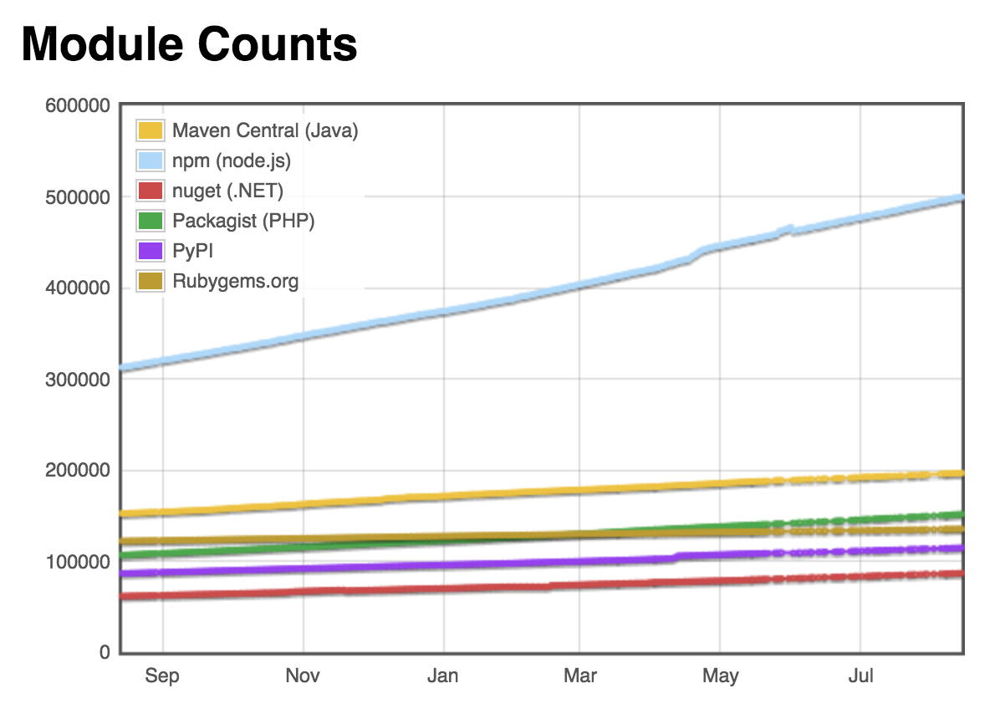
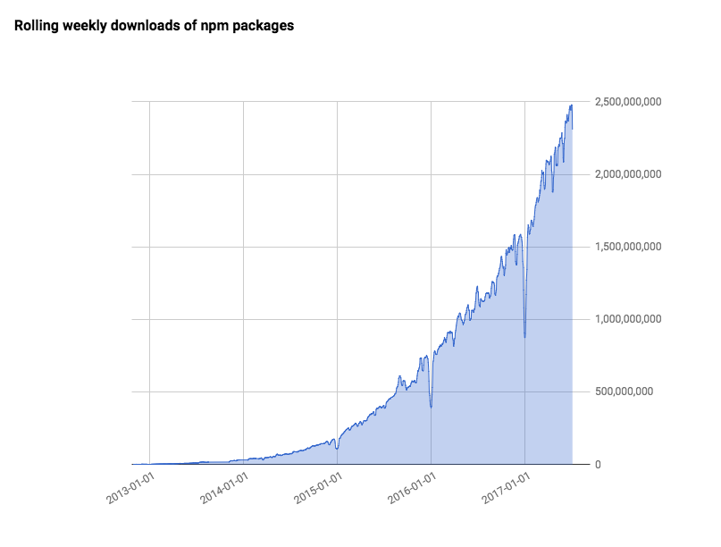

최근 Typescript를 사용하는 Angular(version>=2.x)로 작업을 진행하면서 만들었던 자동완성 컴포넌트가 있었다. 널리 쓰이는 자동완성 컴포넌트에 비해서 뛰어나다고 할 순 없지만 나름 확장성을 고려해서 만들었고 오류 검증도 된 상태였기 때문에 공부하는 셈 치고 NPM 패키지로 만들어보았다. 지금껏 수많은 오픈소스 패키지들을 사용해 왔지만 직접 만들어 본 적은 한 번도 없었기 때문이다.

## NPM

NPM은 Javascript 패키지 관리자다. 개발자들이 서로의 코드를 쉽게 공유할 수 있는 시스템을 구축해 둔 덕분에 자바스크립트 커뮤니티는 짧은 시간 안에 큰 양적인 성장을 이룰 수 있었다. 패키지 다운로드도 편리하고 버전, 의존성 관리도 잘 되어있기 때문에 서로가 서로의 패키지를 사용하면서 거대한 자바스크립트 소프트웨어 생태계가 구축된 상태다.


*2017년 8월 현재 NPM 패키지는 약 50만개가 존재한다. [(modulecounts.com)](http://www.modulecounts.com/)*


*NPM 패키지는 한 주에 20억 회 이상 다운로드되고 있다. [(npm weekly #101)](https://medium.com/npm-inc/npm-weekly-101-how-many-npm-users-are-there-why-use-semver-want-to-work-with-us-3f0171fd7f78)*


## package.json

node.js 환경에서 NPM 패키지 초기화 명령어를 통해 package.json 파일이 생성되면 그 폴더는 일단 NPM 패키지라고 할 수 있다. NPM 패키지는 package.json을 통해 관리된다. 이 파일에는 패키지의 이름은 무엇인지, 현재 버전은 어떻게 되는지, 의존하고 있는 모듈은 어떤 것인지 등의 다양한 정보가 포함된다. 이 정보들 중에는 NPM 패키지 배포를 통해 코드를 공유할 때 반드시 필요한 항목들이 있고, 개인 프로젝트의 경우에는 굳이 작성하지 않아도 되는 항목들이 있다. 대표적으로 패키지를 불러올 때 진입점으로 사용할 파일을 명시하는 `main` 항목은 배포를 목적으로 하는 경우 꼭 작성해야 한다.

아래는 이번에 개발한 패키지의 package.json 파일의 일부분이다.

```json
{
  "name": "ng2-simple-autocomplete",
  "version": "0.5.1",
  "main": "dist/index.js",
  "typings": "definitions/index.d.ts",
  "engines": {
    "node": ">= 4.2.1",
    "npm": ">= 3"
  },
  "license": "MIT",
  "scripts": {
    "start": "npm run server:dev",
    ...
  },
  "dependencies": {
    "@angular/core": "~4.1.2",
    ...

  },
  "devDependencies": {
    "@angular/compiler-cli": "~4.0.3",
    ...
  }
}
```

### name

이름은 중복되지 않는 고유한 이름을 사용해야 한다.

그런데 패키지의 수가 50만을 향해가고 있기 때문에 적당한 이름을 만들기가 무척 어려워진 상태다. 그래서 패키지 이름 앞에 [scope](https://docs.npmjs.com/getting-started/scoped-packages)를 붙일 수도 있다. 대표적으로는 Javascript로 작성된 패키지를 Typescript에서 사용하기 위해 타입 정의 파일([declaration file](https://www.typescriptlang.org/docs/handbook/declaration-files/introduction.html))을 제공하는 패키지 앞에 붙이는 [@types](https://www.npmjs.com/search?q=@types&page=1&ranking=optimal)가 있다. 예를 들어 lodash 패키지의 타입 정의 파일은 @types/lodash 패키지에 배포되고 있다.


### version

패키지의 버전을 명시한다. 배포를 위해서는 [유효한 버전 문자열](http://semver.org/)이 작성되어 있어야 하고 이전 배포 버전과 같아서는 안된다. [npm version 명령어](https://docs.npmjs.com/cli/version)를 사용하면 패키지의 버전을 major, minor, patch 등의 상황에 맞는 버전 문자열로 자동으로 업데이트하고 배포 관련 npm script도 자동으로 실행할 수 있다.

### main

Javascript 소스에서 패키지를 불러왔을 때 접근하는 파일명이다.

```js
import { Ng2SimpleAutocomplete } from 'ng2-simple-autocomplete';
```

위의 코드에서는 `Ng2SimpleAutocomplete`라는 모듈을 불러왔다. main에 지정된 파일에 해당 모듈이 export되어 있지 않다면 자연스럽게 not found 에러가 발생할 것이다.


### typings

타입 정의 파일의 위치를 명시한다. 일반 Javascript 패키지에는 필요하지 않지만 Typescript로 개발된 패키지는 이 항목이 필요하다.

NPM은 Javascript로 작성된 모듈을 불러올 수 있으므로 Typescript로 패키지를 작성했더라도 배포된 파일은 Javascript로 컴파일된 형태여야 한다. 그리고 컴파일된 파일에는 Typescript에서 작성한 타입 주석이 모두 제외되어 있다. 게다가 interface 처럼 Typescript에만 있는 값을 export했을 경우에는 해당 모듈을 아예 찾을 수 없다는 에러를 발생시킨다. 그래서 컴파일 시에 타입 정의 파일도 생성시키도록 하고, package.json 파일에도 typings 항목을 작성해야 Typescript로 작성된 모듈을 NPM을 통해 공유할 수 있다.

### scripts

NPM 스크립트를 사용하면 패키지에 설치된 모듈을 실행할 수 있다. NPM 스크립트를 사용하지 않더라도 아래와 같은 방법으로 실행할 수 있긴 한다.


```bash
./node_modules/typescript/bin/tsc
```

하지만 NPM 스크립트를 이용하면 바이너리 파일의 위치를 생략하고 실행할 수 있다는 편리함이 있다. 그리고 자주 사용하는 명령어들을 저장해둘 수 있고 다른 NPM 스크립트를 실행할 수도 있기 때문에 이제는 빌드 및 배포 프로세스 실행을 위해서 많이 사용되고 있다. grunt, gulp도 여전히 강력한 도구지만 NPM 스크립트만으로도 가능한 작업들이 많기 때문에 예전보다는 사용 빈도가 줄어들었다고 할 수 있다.

### dependencies & devDependencies

패키지에 설치된 다른 NPM 모듈들의 이름과 버전이 명시되어 있다. 처음 NPM을 사용했을 땐 왜 저 두 항목으로 구분해 두었는지 이해가 가지 않았지만 패키지 배포의 측면에서 생각해보니 쉽게 이해가 되었다.

dependencies 항목에 포함된 패키지들은 패키지를 공유받은 사람에게 필요한 패키지들이다. 하지만 devDependencies 항목의 패키지들은 공유받은 사람들에게는 없어도 되는 패키지들이다. dependencies에 @angular/core 같은 필수 패키지가 들어간다면 devDependencies에는 테스트, 배포를 위한 패키지들이 들어간다고 볼 수 있다. 하지만 배포를 하지 않는다면 굳이 구분할 필요는 없고, 배포된다 하더라도 딱히 문제를 발생시키지는 않는다. 다만 패키지의 덩치를 필요없이 키우는 결과를 낳기 때문에 좋은 소리는 듣지 못할 것이다.


## Typescript 파일 컴파일

이번 패키지를 개발할 때 테스트 코드는 작성하지 않았고 브라우저에서 작동되는 모습을 보면서 개발을 진행했다. 그래서 일반 앱처럼대신 프로젝트를 구성하는 대신  배포를 위한 빌드 프로세스만 따로 추가하는 방법을 사용했다. 프로젝트 베이스로는 [angular starter](https://github.com/AngularClass/angular-starter)를 사용했고 빌드 프로세스 구성에는 Gulp를 사용했다. 그래서 tsconfig.json 파일도 개발용 앱을 위한 설정, 빌드를 위한 설정을 가진 파일을 따로 만들어서 사용했다.

아래 소스는 Typescript 파일을 Javascript 파일로 변환하는 과정이다.

```js
var gulp = require('gulp');
var ts = require('gulp-typescript');

gulp.task('build', function() {
    var merge = require('merge2');
    var tsProject = ts.createProject('tsconfig.json');

    var tsResult = tsProject.src()
        .pipe(tsProject());

    return merge([
        tsResult.dts.pipe(gulp.dest('./definitions')),
        tsResult.js.pipe(gulp.dest(tsProject.config.compilerOptions.outDir))
    ]);
});
```

tsconfig.json 파일에는 어떤 소스 파일을 컴파일할지, 컴파일 옵션에는 무엇을 사용할지, 컴파일 결과는 어디에 저장할지 등의 정보가 포함되어 있기 때문에 태스크 내부에서 별도의 설정이 필요하지 않다.

타입 정의 파일은 `tsResult.dts.pipe` 함수를 사용해서 저장하고 컴파일된 Javascript 파일은 `tsResult.js.pipe`함수를 통해 저장한다.


## NPM 저장소에 배포

배포하기 전에 .npmignore 파일을 생성해서 배포하지 않을 파일들을 지정해야 한다. 각종 설정 파일, 원본 소스 파일 등은 NPM 저장소에 굳이 올라갈 필요가 없기 때문이다. .gitignore 파일을 작성하는 것과 같은 개념이다. 아래는 .npmignore 파일의 일부분이다.

```
.awcache
.vscode
config
src
node_modules
(...)
```

배포는 NPM 커맨드라인 명령어를 사용한다.

```bash
npm version [major | minor | patch | ...] -m "update message"
```

npm version 명령어를 사용하면 package.json에 명시된 버전을 자동으로 업데이트 해준다. 그리고 package.json 의 script 항목에 'version'이라는 이름의 스크립트가 있을 경우 해당 스크립트도 함께 실행한다.

아래 NPM 스크립트에서는 npm version 명령을 실행하면 빌드를 실행한 후 npm publish 명령어를 통해 NPM 저장소에 배포되도록 구성했다.

```json
{
  "scripts": {
    "version": "npm run build && npm run npm:publish",
    "npm:publish": "npm publish",
    "build": "npm run build:npm",
    "build:npm": "gulp"
  }
}
```

그리고 Git 저장소에서 npm version 명령어를 사용하면 변경된 package.json 파일을 자동으로 커밋해준다. 커밋 메시지에는 버전명이 들어간다.

---

첫 NPM 패키지 개발을 Typescript로 진행하다보니 문제도 많이 발생했고 시간도 제법 많이 걸렸다. 그래도 처음부터 끝까지 하나의 과정을 진행하고 마무리 지으며 많은 부분을 경험할 수 있어서 좋았다.

그리고 내가 배포한 패키지의 다운로드 수가 적다 하더라도 불특정 다수에게 공개된다고 생각하니 코드 작성에 더 신중해지고 오류가 발생해도 빠르게 대처하게 되었다. 이는 자율적으로 하는 작업과 실무처럼 외부의 요구에 의해 하는 작업의 차이에서 왔을 것이다. 구글같은 회사에서 왜 직원들에게 일정 시간은 개인 프로젝트를 진행하게 하는지 그 이유를 제대로 알게 되었다고나 할까.

이번에 개발한 패키지는 [ng2-simple-autocomplete](https://www.npmjs.com/package/ng2-simple-autocomplete)라는 이름을 가지고 NPM 저장소에 배포되어 있다.


