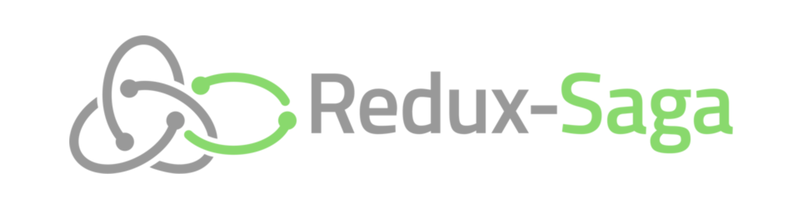

[Redux](http://redux.js.org/)를 사용하면 React 앱에서 데이터를 처리하는 비즈니스 로직을 컴포넌트로부터 분리할 수 있다. 그리고 비즈니스 로직은 보통 [액션](http://redux.js.org/docs/basics/Actions.html) 객체를 반환하는 액션 생성자 함수 내부에서 작성하는 방식이 권장된다.

그런데 액션 생성자 함수에서 API 호출 같은 비동기 프로세스 구현을 위해 Promise를 사용하면 resolve 시점에서 객체를 직전 리턴할 수 없다. 그래서 비동기 처리를 할 때 액션 객체를 반환하는 대신 함수 내부에서 직접 [store.dispatch](http://redux.js.org/docs/api/Store.html#dispatch) 함수를 통해 액션을 발생시킬 수 있도록 하는 [redux-thunk](https://github.com/gaearon/redux-thunk) 미들웨어를 사용한다.

```js
const fetchAction = () => {
  return (dispatch) => {
    fetch('/api/data').then((res) => {
      dispatch({
        type: 'FETCH_ACTION_SUCCESS',
        payload: res.json()
      })
    })
  }
}
```

하지만 복수의 Promise를 순차적으로 실행하려면 함수 중첩이 계속 발생해서 if ~ else 만큼이나 가독성이 떨어진다. ES7에서 도입된 [async 함수](https://developer.mozilla.org/ko/docs/Web/JavaScript/Reference/Statements/async_function)를 사용하면 비동기 프로세스를 보다 간결하게 작성할 수 있다.

```js
async function fetchAction() {
  return (dispatch) => {
    const res = await fetch('/api/data')
    dispatch({
      type: 'FETCH_ACTION_SUCCESS',
      payload: res.json()
    })
  }
}
```

그리고 Redux 미들웨어인 [Redux-Saga](https://redux-saga.js.org/)를 사용하면 비동기 액션은 물론 다양한 사이드 이펙트를 발생시킬 수 있는 헬퍼 함수를 활용해서 복잡한 로직을 쉽게 구현할 수 있다.

## Redux-Saga



Redux-Saga는 ES6에서 도입된 [Generator 함수](https://developer.mozilla.org/ko/docs/Web/JavaScript/Reference/Statements/function*)를 기반으로 한다.

Generator 함수는 코드 진행 중에 `yield` 키워드를 만나면 일단 멈춘다. 그리고 계속 진행하라는 지시[(`Generator.prototype.next`)](https://developer.mozilla.org/ko/docs/Web/JavaScript/Reference/Global_Objects/Generator/next)가 전달되어야 다음 `yield` 키워드 까지 코드를 진행시킨다. Redux-Saga는 이 Generator 함수의 특징을 활용한다.

```js
function* takeFetchAction() {
  yield takeEvery('FETCH_ACTION', dataFetch)
}

function* dataFetch(action) {
  const result = yield call(() => fetch('/api/data'))
  yield put({
    type: 'FETCH_ACTION_SUCCESS',
    payload: result.json()
  })
}
```

위의 예제에서는 [`takeEvery`](https://redux-saga.js.org/docs/api/#takeeverypattern-saga-args) 함수를 사용해서 스토어에 `FETCH_ACTION` 타입의 액션이 전달될 때마다 콜백 함수를 실행한다. 그리고 [`call`](https://redux-saga.js.org/docs/api/#callfn-args) 함수에 Promise를 반환하는 함수를 인자로 전달해서 실행한 후 대기한다. 그리고 Promise가 resolve되면 Redux-Saga는 Generator 함수를 진행시킨다. 그렇게 비동기 요청이 끝나고 나면 [`put`](https://redux-saga.js.org/docs/api/#putaction) 함수를 사용해서 새로운 액션을 스토어에 전달한다.

로그인 프로세스도 하나의 Redux-Saga 함수 안에서 작성 가능하다.

```js
function* loginFlow() {
  while (true) {
    yield take('LOGIN')
    // ... perform the login logic
    yield take('LOGOUT')
    // ... perform the logout logic
  }
}
```

위의 코드는 단순화시킨 형태일 뿐이며 실제로는 non-blocking 액션 처리, 진행중인 [태스크](https://redux-saga.js.org/docs/api/) 취소 등의 [구체적인 로직](https://redux-saga.js.org/docs/advanced/NonBlockingCalls.html)이 더 필요하다. 하지만 앱 내부 여기저기서 발생하는 액션들에 의한 프로세스를 하나의 함수 안에서 마치 동기적인 코드처럼 작성할 수 있다는 점은 무척 큰 매력이다. Redux-Saga는 분리된 비즈니스 로직을 한곳에 모은 **프로세스 명세서**, 또는 **프로세스 관리자** 같은 개념으로 받아들여도 될 것 같다.

## Redux-Saga로 토스트 메시지 제어하기

Redux-Saga는 네트워크 입출력뿐만 아니라 비동기적으로 처리되는 UI 구현에도 도움을 줄 수 있다. 예를 들어 토스트 팝업 메시지가 표시되면 3초 후에 자동으로 닫히는 UI를 구현한다고 하자. 그리고 토스트 메시지는 동시에 여러 개가 화면에 표시되어야 한다.

이를 구현하기 위해서는 토스트 메시지를 가진 객체로 구성된 큐(queue)가 필요하다. 메시지가 발생하면 큐에 메시지를 추가해서 화면에 표시하고 3초 후에 큐에서 제거하여 화면에서 사라지도록 한다. 이 과정을 Redux-Saga에서 구현해 보았다. 큐는 Redux store에 두고 Saga에서 메시지 객체를 큐에 추가하고 제거하도록 했다.

```js
// @flow
import types from '../../actions/actionTypes'
import { delay } from 'redux-saga'
import { all, put, takeEvery } from 'redux-saga/effects'
import { ShowToastMessageAction } from '../../actions/toast'

function* show() {
  // SHOW_TOAST 액션이 발생할 때마다 toastQueueControl 함수를 실행한다.
  yield takeEvery(types.SHOW_TOAST, toastQueueControl)
}

function* toastQueueControl(action: ShowToastMessageAction) {
  // 토스트 메시지 큐에 메시지를 추가한다.
  yield put({
    type: types.PUSH_TOAST_TO_QUEUE,
    toast: action.toast,
  })

  // 3초 기다린다
  yield delay(3000)

  // 큐에서 메시지를 제거한다.
  yield put({
    type: types.SHIFT_TOAST_FROM_QUEUE,
  })
}

export default function* toast() {
  yield all([show()])
}
```

로직은 무척 간단하며 컴포넌트, 리듀서와 완전히 분리되어 있어 입력과 출력이 어떻게 발생하는지 직관적으로 확인할 수 있다. 데이터를 변경하는 로직은 리듀서에서 구현하고, 주어진 데이터로 UI를 구현하는 일은 컴포넌트에서 하고, Redux-Saga는 이 모든 것을 컨트롤함으로써 역할 분담이 더 명확해졌다.

실제 구현 예제는 아래의 링크에서 확인 가능하다.

[https://rhostem.github.io/redux-saga-toast-control/](https://rhostem.github.io/redux-saga-toast-control/)
[(source)](https://github.com/rhostem/redux-saga-toast-control)

## Redux-Thunk에서 Redux-Saga로

실무에서 Redux-Saga를 사용하며 이제 더는 Redux-Thunk를 사용하지 않아도 되겠다는 판단이 들었다. Saga 함수를 작성할 파일이 추가되어서 관리 포인트가 늘어나긴 하지만 액션 생성자의 복잡도와 덩치를 줄일 수 있다는 점이 무척 마음에 들었다. 특히 다양한 사이드 이펙트를 함수를 제공한다는 점도 좋다. 대표적으로 `call` 함수를 사용하면 Promise도 처리할 수 있으니 async/await를 사용하기 위해 별도의 babel 설정을 하지 않아도 된다.

Redux-Saga는 ES6의 Generator 함수를 제대로 활용한 멋진 라이브러리다. 공식 홈페이지의 문서와 관련 아티클들을 꼼꼼히 살펴보며 깊이 파고들 가치가 충분히 있어 보인다.